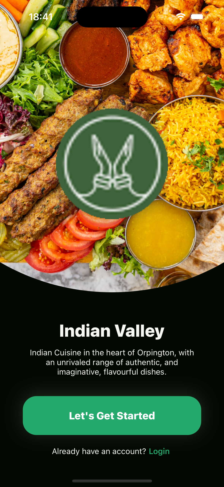
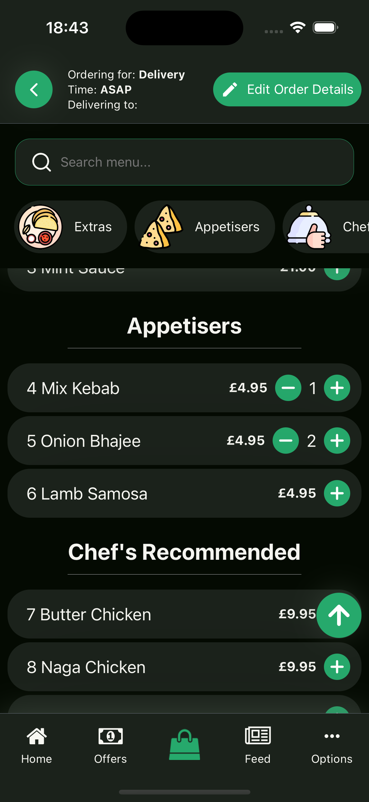

# Indian Valley Customer App

A mobile application developed using React Native and Expo for Indian Valley, a local restaurant. This app allows customers to browse the menu, place orders, and receive real-time updates on their orders.

## Features

- Browse full restaurant menu with categories and item descriptions.
- Add items to cart and place orders seamlessly.
- Real-time order status updates.
- Secure user authentication and profile management.
- Responsive design compatible with both Android and iOS devices.

## Tech Stack
- Frontend: React Native with Expo
- Backend: Node.js with Express (see server repository)
- Database: Supabase
- Authentication: Supabase Auth
    
## Installation & Running the App

Will be available to download and install from Google Play and the App Store

## Screenshots

|                   Welcome                    |                  Login                   |                   Signup                   |
|:--------------------------------------------:|:----------------------------------------:|:------------------------------------------:|
|  |  |  |

|                  Home                  |                 Menu 1                  |                 Menu 2                  |
|:--------------------------------------:|:---------------------------------------:|:---------------------------------------:|
|  |  |  |

|                  Cart                  |                     Order Confirmation                      |      
|:--------------------------------------:|:-----------------------------------------------------------:|
|  |  |

